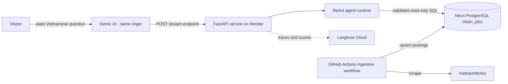
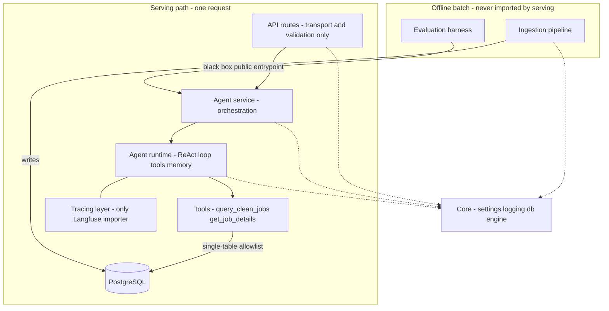

# Architecture

> **Eviction:** A section leaves when the implementation it explains is retired or its decision is
> superseded.

This document owns product scope, architecture, agent runtime, serving, schema evolution, and
ingestion design.
Operational procedures live in [how-to/operate.md](how-to/operate.md); evaluation in
[how-to/evaluate.md](how-to/evaluate.md); configuration and stack in
[reference/configuration.md](reference/configuration.md).
Durable decisions are recorded under [decisions/](decisions/README.md).

## C4 context view

The system is one conversation surface over a read-only job-posting corpus.



## C4 container view




## 1. Product and MVP bar

### 1.1 Purpose

InternHunterAgent helps a job seeker find and understand AI and data job opportunities, internships
and full roles alike, by talking to an agent instead of scrolling listings.
The user asks about postings in plain Vietnamese, refines the question naturally, and gets answers
they can trust because every answer is grounded in real posting data rather than the model's
parameters.

The MVP exists to prove one thing well: a trustworthy, conversational front door to real AI and
data job-posting data.
Everything richer - resumes, recommendations, charts, live feeds - builds on that foundation and
comes later.

### 1.2 What the MVP must be able to do

These are capabilities a user can observe, independent of how they are built.

- **Answer real job questions.** The agent answers questions about AI and data postings - titles,
  companies, tech stacks, descriptions, counts, filters, including whether a posting is an
  internship - from actual stored data. It never fabricates a posting or a detail.
- **Serve a corpus that refreshes itself.** Postings are re-collected automatically on a schedule
  against the production database with no human running anything. A hand-loaded corpus does not
  satisfy this: a user asking today is answered from the most recent completed run, not from a
  frozen extract.
- **Hold a conversation.** A user can ask an initial question and refine it naturally - "only the
  Python ones", "which of those are remote" - without restating earlier context.
- **Remember within a session.** Each conversation is remembered while it is happening, persists
  across service restarts, and keeps working when more than one instance runs.
- **Stay safe and read-only.** The agent only reads. It never modifies anything, and it refuses
  requests it cannot or should not fulfil rather than guessing.
- **Be observable.** Every interaction is captured as a trace that can be followed end to end, so
  any answer can be inspected and explained after the fact.

### 1.3 Quality bar

- **Trustworthy over impressive.** If the agent can ground an answer in the data it answers; if it
  cannot, it says so plainly. A clear "I cannot answer that from the available data" is a success,
  not a failure. Confident guessing is the worst outcome.
- **Coherent across turns.** Refinement genuinely works. Follow-ups feel like a continuing dialogue,
  not a series of disconnected one-shot questions.
- **Resilient under imperfection.** A vague question, a brand-new conversation with no prior
  context, or a temporary backend problem produces a clean, understandable response - never a crash
  and never a leaked internal error.

An absent field, an unavailable fact, a zero result, a vague question, or a backend fault must each
yield an honest, understandable response instead of invention or an internal error.

### 1.4 Definition of done

The MVP is done when all of the following are observably true.

- A user can ask a job-data question and receive an answer grounded in real posting data.
- The production corpus refreshes on its schedule without manual intervention, and a completed
  scheduled run is observable in the run history.
- A user can refine that question at least twice within one conversation and get consistent,
  context-aware answers.
- Two separate conversations stay independent; neither sees the other's history.
- A user who starts a conversation without a session identity is given one and can use it to
  continue.
- A conversation's memory survives a restart of the service.
- The agent refuses an unsafe or unanswerable request with a clear message instead of failing or
  guessing.
- Every interaction appears as a trace that maps cleanly back to the request.
- The application starts cleanly with a single documented command.

### 1.5 Scope and accepted limitations

In scope: the six capabilities in section 1.2, held to the bar in section 1.3.
Scheduled ingestion is one of them, so a manually loaded static corpus does not meet this
specification however current its contents happen to be on the day it is loaded.

Deferred on purpose, each mapped to a future phase so "not yet" never reads as "forgotten":

- Visual or structured output such as tables and charts; answers are conversational text.
- Resume understanding and personalised matching.
- Similarity and semantic search over postings.
- Accounts, authentication, and multi-user management.
- Continuous, multi-source job data; a real-time feed spanning several boards is a future phase.

Accepted limitations:

- Answers are text-only. No tables, charts, or downloadable results.
- The corpus covers the current VietnamWorks ingestion scope and is not comprehensive.
- The corpus refreshes on a schedule rather than continuously, so between runs it is as current as
  the last completed run. That is an accepted cadence limit, not an accepted freeze.

### 1.6 Future direction

Intent, not commitment.

- **Product experience:** resume upload, then retrieval of similar postings via embeddings, then
  charting and visual answers.
- **Data:** expand beyond VietnamWorks, then ingest more frequently.
- **Platform and operations:** answer-quality evaluation, a richer user-facing UI, managed
  deployment environments, ongoing prompt refinement.

The product can grow in those directions only through a recorded decision and measured design work.


## 2. Layered architecture

## 2. Architecture

### 1 Request lifecycle

The service exposes one conversational endpoint pair and every request follows one fixed path:

```text
QueryRequest
  -> API route (src/api/routes/query.py)        validate, log, no agent knowledge
  -> Service (src/agents/service.py)            the sole caller of the runtime
  -> Agent runtime (src/agents/runtime/react_agent.py)
       -> ReAct loop over the assembled agent (model + prompt + tools + memory)
       -> tracing wrap (src/agents/tracing/langfuse.py, build_langfuse_config)
  -> QueryResponse
```

The route knows nothing about LangChain, the service owns request-level orchestration, and the
runtime is the only place the agent is constructed and executed.

There are two delivery paths over the same layering, not two architectures.
The one-shot path drives `AgentRuntime.ainvoke` and returns a finished body.
The streaming path drives the agent's streamed extraction and yields typed events (section 4.2).
Both share every agent internal; only delivery differs.

Design philosophy: every layer must be replaceable in isolation without forcing a rewrite of its
neighbors.
At any point in the project's life the correctness of the layer contract matters more than how many
features sit behind it.

### 2 Layer matrix

**API layer** (`src/api/app.py`, `src/api/routes/`, `src/api/schemas.py`).
Owns HTTP transport, Pydantic validation, same-origin static files, and the public response shape.
It calls the application service and must never import LangChain, construct prompts or tools, or
build a tracing client.

**Service layer** (`src/agents/service.py`).
The sole caller of the agent runtime.
Owns request-level orchestration: invoking the runtime, translating runtime and tool failures into a
safe public response, and shaping the dict the API layer serializes.
It holds no LangChain or database knowledge of its own.

**Agent runtime layer** (`src/agents/runtime/`).
The only place permitted to construct the LangChain agent.
`src/agents/runtime/factory.py` assembles the agent with the registered tool list,
`src/agents/runtime/provider.py` wraps the configured chat models,
`src/agents/runtime/prompts.py` loads prompt text from `config/prompts.yaml`, and
`src/agents/runtime/react_agent.py` runs the loop and extracts the final answer.
Two responsibilities are owned here and nowhere else: **tool registration**, since no other layer
may add a tool, and **conversation memory**, since the API and service layers pass a session
identity through but never manage memory themselves.

**Tools layer** (`src/agents/tools/`).
Each tool is a self-contained adapter registered in the factory.
Tools may call internal services freely, but the model never receives a raw execution primitive: no
SQL string, no database session, no internal DTO.
A tool's only public surface is natural language in, bounded plain string out.
A tool may accept a model-supplied *opaque handle*, such as a job id carried over from a previous
result, because a handle is not an execution primitive.

**Tracing layer** (`src/agents/tracing/langfuse.py`).
The only module allowed to import the Langfuse SDK.
It builds the callback handler and exposes `build_langfuse_config()`, consumed by the runtime when
invoking the agent.
If credentials are absent or initialization fails, tracing degrades to a no-op; it never raises and
never blocks a request.

**Core layer** (`src/core/config.py`, `src/core/logger.py`, `src/core/db.py`).
Cross-cutting primitives only: settings, structured JSON logging, and the SQLAlchemy engine and
session factory.
Core holds no business logic and depends on nothing else in the system.
Every other layer may depend on Core, never the reverse.

**Ingestion layer** (`src/services/ingestion/`).
Offline batch tooling that *writes* the domain data the agent later reads.
It runs out of band, never inside a request, and the request pipeline must **never import it**; the
dependency only ever points the other way, with both sharing Core's settings and database
primitives.
This isolation is what lets data acquisition evolve without touching the serving path.

**Evaluation layer** (`evals/`).
Offline quality tooling under the same isolation rule as ingestion.
It treats the agent as a black box through its public entrypoint plus an injected callback.

### 3 Cross-boundary invariants

Some types are permitted inside a layer but must never cross out of it.

- **Raw SQL and tool-internal data structures stop at the tools layer.** Internal DTOs such as the
  ones in `src/services/query/models.py` may be used freely inside tools and services but must
  collapse to a plain string before the result leaves the tool.
- **Langfuse SDK objects stop at the tracing layer.** No route, service, or tool touches a Langfuse
  client directly.
- **LangChain types** (messages, runnables, agent objects) **stop at the runtime layer.**
- **The API response is answer-only.** No raw SQL, table rows, or tool internals may appear in a
  response, regardless of which tools run behind the runtime.
- **A tool's output is bounded in size by construction.** Result cardinality and per-field length
  are capped deterministically inside the tool; a tool never emits an unbounded, model-sized payload
  into the agent loop. Large free-text fields are never returned in bulk: they may be filtered on
  server-side, but their full text is retrieved only through an explicit, bounded, id-based lookup.
  This law exists because a payload can be perfectly valid, a plain string with no leaked internals,
  and still be too large to serve.
- **Session memory is short-term and session-scoped**, although it may persist across restarts.
- **The request path never imports the ingestion or evaluation packages.**

If a change requires passing one of these types across its boundary, the change is wrong, not the
rule.

### 4 Permanent scope exclusions

These are deliberate and permanent, not gaps a future change closes.

- **One model provider per profile**, selected in configuration and constructed by the provider
  wrapper. No multi-provider routing or model-selection logic in the request pipeline.
- **No multi-agent routing**, sub-agents, or agent-to-agent delegation.
- **No in-request autonomous or background execution.** No cron jobs, queues, or schedulers inside
  the API process or triggered by a request. This governs the *serving path* only. The single
  permitted exception is an out-of-band scheduled invocation of the ingestion CLI on external
  infrastructure: a GitHub Actions cron that runs on a GitHub-hosted runner, not inside the API
  process. That preserves the ingestion-layer law in section 2.2, because the scheduler triggers the
  loader as an external process, the same way a maintainer would run it manually, and never touches
  the API, service, runtime, tools, or tracing layers.
- **No cross-session or long-term memory.** Conversation memory is permanently limited to
  session-scoped short-term context. It may be persisted so a conversation survives a restart and
  stays coherent across instances, but it is never shared across sessions and never accumulates into
  user profiles or a long-term store. Long-term recall (user history, resume understanding,
  embedding retrieval) is the excluded capability regardless of how it might be stored.
- **No authentication or authorization layer.**

The production request path therefore has one selected serving provider per profile, no
provider-routing matrix, no in-request scheduler, no background queue, no long-term memory, no
authentication layer, and no agent-to-agent delegation.

### 5 Engineering principles

The system is built infrastructure-and-reliability-first: a stable, traced, hardened request path is
proven before any tool is added, so tool work never gets to skip validation, configuration checking,
or tracing.

"Never over-engineer" is enforced concretely, not aspirationally.

- **SQL is model-proposed, then deterministically validated.** The tool calls a model to *propose* a
  `SELECT`, but a deterministic hand-rolled validator approves it before execution. The generator is
  untrusted; the validator, not the model, is what makes the path safe. There is no model-driven
  query-planning or execution layer.
- **Bounded by construction, not by prompt.** Output size, like query safety, is a deterministic
  guarantee the tool enforces, never a behavior the model is trusted to produce. The tool caps
  result rows and field lengths regardless of what SQL the model proposed. A prompt instruction to
  return few rows is a helpful nudge, never the safeguard.
- **One model provider abstraction**, with a per-profile provider key and no provider-swap matrix
  built in advance of needing one.
- **No post-tool narration.** A tool returns a single deterministic answer string; there is no
  second model call to summarize or re-narrate what a tool already produced. This is distinct from
  the SQL-generation call *inside* the tool, which produces the query, not the answer.
- **Internal richness, external simplicity.** Tools and services may use structured data freely for
  efficiency and traceability, but that richness must collapse to a plain string by the time it
  crosses the API boundary.
- **Schema growth is column-cheap, table-costly.** Answer honesty is derived from the documented
  schema, never a hardcoded field list, so growing the schema never silently turns an honesty rule
  into a falsehood. See the schema-evolution section.


## 3. Agent runtime

## 3. Agent runtime

### 1 Model providers

Chat models are wrapped by the provider in `src/agents/runtime/provider.py`.
This is the one place model construction lives; no other layer constructs a model.

Configuration is read from `config/settings.yaml` under two explicit profiles with the same fields:
`agent.react.*` for the outer conversational ReAct agent, and `agent.sql_generation.*` for the
nested SQL-generation call inside the job-query tool.
Each profile carries `model`, `temperature`, `max_tokens`, `timeout`, `max_retries`, `streaming`,
and its provider's native reasoning knob.
Each profile also carries a `provider` key defaulting to `agent.provider`, so one profile can move
providers while the other stays put.

The builder supports `deepseek` and `groq` and raises on anything else.
The selected branch reads its own key and raises naming the profile when it is unset, so a checkout
need not hold credentials for an unused provider.
Both profiles select DeepSeek (D-045); the Groq branch stays selectable, because two working
branches are what keep the provider seam honest.

The two profiles are deliberately separate: the outer ReAct loop reasons, while SQL generation is
pinned to deterministic sampling.

### 2 System prompt and reasoning

The agent runs a ReAct-style loop.
The model reasons about the user's question, decides whether to call a tool, consumes the tool's
result, and produces a final natural-language answer.

The versioned system prompt is loaded from `config/prompts.yaml` by
`src/agents/runtime/prompts.py` and steers the model to use the job-data tool for any question that
depends on stored postings, rather than answering from its own parameters.
The runtime extracts the final answer from the last message and returns it as a plain string.

The behavior glossary is loaded separately rather than pasted into the system prompt, so the
evaluation grader and the prompt resolve the same phrasings from one source.
The frozen behavior requirements themselves are owned by
[agent behavior reference](reference/agent-behavior.md).

### 3 Tools

Tools are how the agent acts on the world, under one contract: **natural language in, bounded plain
string out**.
Tools are registered exclusively in the factory.

Two tools ship.

- **`query_clean_jobs`** (`src/agents/tools/query_clean_jobs.py`) answers structured questions:
  list, count, aggregate.
- **`get_job_details`** (`src/agents/tools/get_job_details.py`) fetches full prose for a few
  postings by id.

**The query pipeline.**
`query_clean_jobs` runs a fixed, deterministic pipeline rather than handing SQL power to the model.

1. The schema context in `config/prompts.yaml` supplies the table shape to the model.
2. A dedicated model call turns the question into a candidate `SELECT`.
3. `src/services/query/sql_validator.py` is the **security boundary**: a deterministic, hand-rolled
   read-only validator with `SELECT`-only enforcement and allowlist and denylist checks.
4. Only validated SQL reaches `src/services/query/executor.py`, run in a read-only transaction off
   the event loop.
5. Rows are shaped by `src/services/query/table_formatter.py` into an internal artifact, then
   collapsed to a plain answer string before returning.

Read-only invariants: `SELECT` only; any non-`SELECT` or unsafe SQL is refused before execution with
a natural-language message; database errors including timeouts are caught and returned as a safe
message, never crashing the process.
The model only *proposes* SQL, which is why a generation step is acceptable without granting raw
execution capability.

An earlier draft specified parameterized tools exposing typed arguments such as `title` and
`tech_stack`.
The shipped design uses natural language to validated SQL because the validator, not the tool
signature, is the trust boundary.

**Bounded retrieval: structured query versus detail fetch.**
Real ingestion turned the corpus into verbose rows each carrying a large merged `description` blob.
A single tool that returned every column of every matched row overflowed the model's token budget on
broad queries.
The fix is architectural, not a bigger model: retrieval splits along the intent the user actually
has.

- `query_clean_jobs` runs the pipeline above, and the tool boundary enforces two deterministic
  guarantees the model cannot override. It **never projects the `description` blob** into its
  result, and it **caps result rows** at `agent.query.max_rows`. The fetch bound is system-owned,
  not model-owned: `src/services/query/row_bound.py` inspects any trailing `LIMIT` the model wrote
  and treats it as a signal of *explicit user intent*, because the SQL-generation prompt only asks
  for a `LIMIT` when the user requested a specific count. If that `LIMIT` is within the safety cap
  it is honored exactly, fetching and displaying exactly that many rows with no truncation notice.
  Otherwise - no `LIMIT`, or one above the cap - the tool fetches `max_rows + 1` rows as a
  truncation sentinel and displays `max_rows`, so broad queries still get an honest "there are more
  matches, narrow your search" notice. It deliberately does **not** compute an exact total for list
  queries, since a precise count would require a separate `COUNT(*)` and was rejected as unnecessary
  complexity. Scalar and aggregate results pass through untouched, with no truncation notice.
- `get_job_details(ids)` is a **deterministic, parameterized** fetch by id with no model call and no
  SQL generation, because ids carry no natural-language ambiguity. It returns the full
  `description` for a few postings, bounded by `agent.query.max_detail_ids`. This is the *only* path
  that surfaces description prose to the model.

This makes the `description` field **three-moded**: filter-only inside `query_clean_jobs`, where
Postgres reads it server-side and the text never reaches the model; full-text only via
`get_job_details`; and never listed in bulk.
The bridge between the two tools is the row `id` that `query_clean_jobs` returns, which the agent
passes back into `get_job_details` for "tell me about that one" follow-ups.

Surrogate ids are stable within a conversation and are stable across ingestion runs for any row that
persists, because the loader upserts rather than rebuilding the table.
Treat that as a **consequence, not a guarantee**: nothing should start depending on cross-run id
stability, because `(source, external_id)` remains the durable handle and a re-seeded local database
still renumbers.

**Question coverage and the one deferred gap.**
Every question resolves on two axes: does it need the description's prose, and does it want a
scalar, a list, or a few full records.
Structured filters, counts, and rankings - including literal keyword hits inside `description` -
are served by `query_clean_jobs`; "tell me about these" is served by `get_job_details`.
The single uncovered cell is **semantic search over the whole corpus**, meaning questions such as
"which postings are beginner-friendly" answered by meaning rather than keyword.
That needs embeddings and is a future phase.
The honest behavior there is to answer literal keywords and say plainly that the agent cannot yet
search postings by meaning.

**Attributes not backed by a column** such as remote work, mentorship, and visa sponsorship are
answered by keyword-matching the `description` text, with an honesty hedge that the match is based
on posting wording and may be imperfect.
Promoting hot text into a real column at ingestion - the path that produced `role`, `location`, and
`tech_stack` - is the escalation when one becomes a common filter.

Salary ranking guidance and the "count, do not list" rule for how-many questions live in the
SQL-generation prompt, not in tool code.

### 4 Memory

Short-term, session-scoped memory lets a user refine questions across turns within one
conversation.
It is not the whole agent, and it is deliberately scoped.

- **Abstraction.** A conversation is a *thread*, and the API's `session_id` maps to the thread key.
  The agent code is unchanged by the choice of storage behind this.
- **Storage.** Memory is Postgres-backed and persistent, so conversations survive a service restart
  and stay coherent when more than one instance runs. The checkpoint tables live in the
  **application database**, alongside the job corpus, never in Langfuse's separate Postgres.
- **What remembering actually is.** On each turn the prior messages of the thread are replayed into
  the model's context, and the model uses that context to reformulate its next tool call, so "only
  the Python ones" becomes a refined query. There is no special memory-reasoning code: refinement
  quality is a function of the model and prompt, not a bespoke feature.
- **Bound.** A configurable cap under `agent.memory.max_turns` retains a fixed number of complete recent turns in the model context.
  `agent.memory.compaction` summarizes older persisted messages once its trigger is reached, retaining the summary and its configured recent-message window.
  This bounds active session history while preserving the context needed for valid multi-turn references.
  It does not rewrite pre-existing checkpoints.
- **Boundary.** This is short-term within-conversation memory only. Cross-session recall, user
  profiles, and resume or embedding retrieval are long-term memory: a distinct mechanism and an
  explicit future phase, which must not be bolted onto the thread checkpointer.

### 5 Tracing

Tracing is built once in `src/agents/tracing/langfuse.py` and injected into the agent invocation
through `build_langfuse_config()`, which the runtime passes to the agent call.
No route, service, or tool builds its own Langfuse client.

The standing invariant is **one trace per request**, with every tool call appearing as a child span.
Session and user identity are attached as trace metadata, so traces group into per-conversation
timelines.
If credentials are absent or initialization fails, tracing degrades to a no-op.

This invariant is the verification bar for all future tools, not just the ones that exist today.
A new tool that does not show up as a traced span is an incomplete tool, regardless of whether it
returns the right answer.


## 4. Public contract and serving

## 4. Public contract and serving

### 1 One-shot contract

The API exchanges two Pydantic models defined in `src/api/schemas.py`.

- **`QueryRequest`**: `query`, an optional `session_id`, and an optional `user_id`.
- **`QueryResponse`**: `answer`, `session_id`, `trace_id`, and `trace_url`.

The response is **answer-only**: no SQL, table rows, or tool internals ever appear, regardless of
which tools run.
Internal richness must collapse to a plain string before crossing the API boundary.

**Session lifecycle.**
`session_id` is the conversation key.
When a request omits it the service generates one and returns it, so the client can continue the
thread, and the response carries the id actually used rather than a blind echo.

`trace_url` is populated from the Langfuse trace when tracing is configured, and is null only when
tracing is disabled.

The answer-only shape is an MVP choice, not a permanent law.
A future charting capability is not a string, and revisiting the shape is what that would require.

### 2 Streaming delivery

One-shot delivery makes the user wait on a spinner for the whole run and then shows the entire
answer at once.
Streaming changes the **delivery contract** from "return one finished value" to "yield the answer as
the model produces it", so the first words appear in about a second.
It does not change *what* the agent computes, only *how* the result is delivered.

**The contract shift.**
A one-shot function returns a value once; a streaming function yields pieces over time.
The defining constraint is that **this shape must hold through every layer**: route, service,
runtime.
A single layer that collects the whole stream into a value before passing it on collapses streaming
back into one-shot, silently, while still passing a naive test.

Each layer keeps its existing responsibility.

- **Runtime** gains a streaming method beside `ainvoke`. It drives the agent's streamed extraction
  and yields small transport-agnostic event dicts, not HTTP or SSE constructs, so the runtime still
  knows nothing about the wire.
- **Service** gains a streaming sibling that mints the `session_id` up front, passes runtime events
  through, and owns fallback and error *policy*, delivered as yielded events rather than raised
  exceptions.
- **Route** gains a streaming endpoint that is the **only** layer aware of the wire format.

**The no-leak filter, the one hard problem.**
One-shot delivery enforces the answer-only law for free, because answer extraction takes only the
final message and discards intermediate reasoning, tool calls, and raw rows.
Streaming forfeits that: a raw message stream emits **every** token from every node, including the
tools node's raw output and any model reasoning that precedes a tool call.
Streaming therefore has to re-earn the guarantee with an explicit filter.

The agent is a standard two-node ReAct graph: a **model node** and a **tools node**.
Each streamed chunk carries its originating node name.
The filter is two gates.

1. **Node gate.** Emit only chunks from the model node; drop the tools node entirely. This kills the
   worst leaks: the tools node's raw rows, **and the raw SQL emitted by the nested SQL-generation
   model call that runs inside the query tool**, which executes under the tools node and is
   therefore excluded automatically. This is exactly why a naive "stream only text deltas" filter is
   insufficient: SQL generation produces text too, so scoping to the model node rather than to "any
   text" is the actual guarantee.
2. **Tool-call gate.** Within the model node, drop chunks that carry tool-call plumbing, which
   normally rides an otherwise empty-content chunk.

What survives both gates is model-authored answer text.

**Residual risk.** If the model narrates reasoning *as content* on the same turn it calls a tool
("let me look that up"), that text streams before the tool-call gate can fire.
This is model- and prompt-dependent.
It is handled at MVP scope by a system-prompt instruction not to narrate before tool calls and - the
load-bearing half - a **leak test** that runs a tool-invoking query and asserts no SQL, tool name,
or row data ever appears in the streamed tokens.
Heavier machinery, such as buffering a whole turn to be certain, is rejected: it would defeat
streaming on the final turn, the one turn that most needs to stream.

**The model-node name is verified, not assumed.**
Agent builders differ in what they call the model node, and node names can change across versions.
The compiled graph was inspected directly to confirm which node emits the answer.
Re-confirm with a node-and-content probe if the LangChain version or the factory changes.

**Metadata timing: trace data trails the answer.**
Trace identity only exists after the run completes and Langfuse flushes, so it cannot lead the
stream.
The event order is therefore fixed: tokens first, then a single trailing metadata event once the
trace link is resolvable, then a terminal done event.
The UI shows the answer immediately and the trace link appears a beat later.
`session_id`, by contrast, is known before the run and is emitted as the **first** event so the
client can pin the conversation key immediately.

**Transport.**
Server-Sent Events: a long-lived `text/event-stream` response of typed blocks.
Chosen over the two alternatives.
Plain chunked text has no structure, leaving nowhere clean to put the trailing trace metadata or an
in-band error, so it grows an ad-hoc protocol anyway.
WebSocket is a bidirectional persistent connection and is overkill for a one-directional
server-to-client token stream.

The event vocabulary:

| Event | Payload | When |
|---|---|---|
| `session` | `{session_id}` | first, before any token |
| `token` | `{text}` | each surviving chunk, many |
| `metadata` | `{trace_id, trace_url}` | once, after the token stream ends |
| `error` | `{message, code, retryable}` | in place of further tokens on mid-run failure |
| `done` | `{}` | terminal, always closes the stream |

Each token is **JSON-wrapped** rather than raw, because the wire format is newline-framed and model
tokens contain newlines; JSON escaping keeps one token to one safe data line.

When the runtime is temporarily silent, the route emits `: ping\n\n` at the configured
`api.stream_heartbeat_seconds` cadence. This is an SSE comment, not a sixth application event, so
compliant SSE parsers ignore it and the client behavior and named-event ordering remain unchanged.
It keeps the connection active through normal proxy idle windows while the agent performs tool work;
it does not add reconnect, replay, or persistence behavior (ADR-0050).

No new dependency is needed: FastAPI ships a native event-source response.
An implementation finding kept the route explicit anyway - the installed version does not
auto-encode yielded event objects, and the higher-level producer path conflicts with the required
pre-stream blank-query rejection.
The endpoint therefore JSON-frames the small event blocks itself and sets the anti-buffering headers
`Cache-Control: no-cache` and `X-Accel-Buffering: no`.
OpenAPI publishes the five logical event blocks as a discriminated schema for API consumers, while
the route deliberately retains this hand-built framing as an `EventSourceResponse` upgrade guard:
framework upgrades must not silently change the wire bytes.
This still avoids a third-party SSE dependency and keeps the API layer limited to wire-format
translation.

The browser cannot use the native `EventSource` API here, because it is GET-only while the streaming
endpoint is a POST with a JSON body.
The client consumes the stream with `fetch()` plus a `ReadableStream` reader instead.

**Disconnect cancellation.** While awaiting each service event, the route polls for client
disconnection. A disconnect cancels and closes the service generator, which cancels the runtime
producer and runs tracing cleanup; it logs `stream.client_disconnected` once and emits no further
SSE events. Connected streams retain the event order above, including terminal `done`. There is no
resume, replay, or persistence of partial output.

### 3 Error handling

The quality bar in section 1.3 requires that imperfect input or a backend hiccup yields a clean
response, never a crash and never a leaked internal error.

- **Tool and database failures** are caught inside the tool and returned as a safe natural-language
  message. Validator refusals and executor errors both degrade gracefully.
- **Tracing failures** never affect the request path; tracing is a no-op when unavailable.
- **Client-input errors** are distinguished from server and provider errors. A blank or
  whitespace-only query raises a typed error from `src/core/errors.py`, mapped to a clean `400`,
  while genuine internal failures map to a generic `500` with no internals leaked.
- **An empty runtime answer** is coerced to a safe fallback string rather than failing validation,
  so an empty agent answer returns `200` with the fallback, not a `500`.

The typed error contract is intentionally minimal: a single `4xx` and `5xx` split, not a broader
error taxonomy.

**Under a stream the mapping changes at a hard line.**
The moment the first event is sent the response status is already `200` and cannot carry an error.
Because the session event is emitted first, before the agent runs, that line is crossed
immediately, so the model call and any provider-busy it raises are always after it.

- **Pre-stream failures use status codes, and there is exactly one.** Empty-query validation happens
  before the generator starts, so it still returns a clean `400`. The per-IP rate limiter also
  rejects with `429` before the route body runs, but that is middleware, not this path.
- **Provider-busy cannot be a pre-stream status.** It can only be known once the model runs, which
  is after the session event has committed the `200`. So, unlike the one-shot path which maps
  provider-busy to a `429`, under streaming it is delivered in-band. This is a deliberate
  consequence of session-first ordering, not an oversight.
- **All runtime failures are in-band error events.** Once the stream has started, a provider hiccup
  or internal failure is delivered as an error event with a safe message, followed by done. Every
  error also has a stable machine-readable `code` and `retryable` flag: provider pressure (including
  provider timeouts) is `{code: "provider_busy", retryable: true}`, while an unclassified failure is
  `{code: "internal_error", retryable: false}`. The existing provider-busy classification still runs
  for logging; only the *delivery* changes from raised exception to yielded event. No exception text
  ever crosses the boundary. The UI renders the safe message as a chat bubble.
- **The empty-answer fallback moves to stream end.** In a stream, emptiness is only known when the
  token stream closes with nothing emitted, so the fallback is decided at end-of-stream and sent as
  a single token.

**What streaming does not add.**
Resumable or replayable streams, retry-from-last-token, multi-node progress indicators, and per-tool
streamed status are explicitly excluded.
The demo streams the final answer only.
The streamed answer routes through the same tool and prompt path the evaluation harness scores, so
streaming adds no bypass.

### 4 Public-endpoint hardening

Exposing the agent publicly adds a distinct concern: the endpoint must survive an untrusted internet
without a WAF, an API gateway, or an auth layer, none of which the MVP has or needs.
Four narrow controls, all assembled in `src/api/app.py` and all configured under `api.*` in
`config/settings.yaml`, carry that load.
They are deliberately not an auth system: the demo is public by design, and these bound *abuse*, not
*access*.

**Middleware nesting is verified, not assumed.**
Starlette inserts each registered middleware at the front of the stack, so the **last** registered
middleware is the **outermost**.
Confirmed against the built app, the order is frame guard, then CORS, then routes.
The frame guard being outermost is what makes its header apply to *every* response - API, static
asset, docs page, and error alike - rather than only to responses that reach the router.

**CORS.**
The middleware is configured from `api.cors.*` through a defensive loader that tolerates a missing
or malformed `api` block rather than failing startup.
Two decisions are recorded here because the config alone reads as an oversight.

- `allow_credentials: false` is permanent. The API has no cookies or sessions to carry, and
  credential-less CORS is the safe default.
- An empty `allowed_origins` list is deliberate, not unfinished. The UI is served from the same
  origin as the API, so no cross-origin request exists to permit. The empty list is therefore the
  *correct* production value and the middleware is effectively inert. It is retained rather than
  deleted because a future separately-hosted frontend is then a config change, not a code change.

**Per-IP rate limiting.**
The limiter keys on client IP with the limit string from `api.rate_limit`.
It applies to the chat routes and **not** to health or readiness: an uptime probe must never be
throttled, and those endpoints exist precisely to be polled.
A rate-limit rejection returns `429` with the **same body the provider-busy path returns** and a
standard `Retry-After` header. The handler derives the header's positive delay from the active
SlowAPI rate-limit window, so clients can wait deterministically before retrying. The shared safe body is
intentional: a visitor who is rate-limited and a visitor who arrived during provider pressure both
see one honest "busy, try again" message, and neither learns which internal condition fired.

> **The limiter is in-process, which couples this section to the deploy topology.** Counters live in
> the worker's memory, so with *n* workers the effective limit is *n* times the configured value.
> The deployment runs a single worker, which makes the configured number the real number. **Scaling
> past one worker silently multiplies the limit** and is the point at which this must become a
> shared-store limiter or move to an edge layer. A single-instance free tier is the reason the
> simple version is adequate today, not an argument that it generalizes.

**Request length cap.**
The query field carries a Pydantic maximum length, so an oversized prompt is rejected at validation
before reaching the agent, bounding both token spend and the checkpointer row a long input would
write.

> **Known deviation from the configuration convention.** `api.max_query_chars` is recorded in
> `config/settings.yaml`, but `src/api/schemas.py` enforces a *static* constant, because a Pydantic
> field constraint is evaluated at class-definition time and does not read the YAML. The two agree
> by hand, not by construction, which contradicts the project rule that parameters live in
> settings. **Changing one without the other silently does nothing.** Closing it means either a
> config-backed schema loader or dropping the unused YAML key. Tracked in
> Open cost decisions and cron activation gates are GitHub Issues.

**API documentation exposure.**
A single `api.docs_enabled` flag gates the interactive docs, the alternate docs, and the OpenAPI
schema together, applied at application construction by passing no URL for each when disabled, so
the routes are never registered rather than registered and then blocked.
Keeping them public is a deliberate portfolio choice: the demo's audience includes people evaluating
the API design, and the schema reveals nothing the answer-only contract does not already imply.
The single flag exists so that judgement can be reversed in one line.

### 5 Demo surface

The demo is an editorial vanilla HTML, CSS, and JavaScript interface in `src/api/static/`, served
from the same FastAPI origin with no client build toolchain.

**Same-origin static serving.**
The application mounts the static directory at the root with HTML fallback.
Serving the UI from the API process, rather than a separate static host, is what makes the empty
CORS origin list correct and removes an entire class of cross-origin and preflight problems from a
demo that gains nothing from being split.

> **Mount ordering is a correctness constraint, not style.** The root mount is registered **after**
> both routers and must stay there. A mount at the root matches every path, so registering it
> earlier would shadow the API and docs routes, and the failure looks like a `404` from the API
> rather than a routing mistake. Treat the position of the mount call as load-bearing.

**Frame protection.**
The frame guard is a **pure-ASGI** middleware that injects a deny header by wrapping the
response-start message.
Being outermost, it covers every response the app can emit.

It is hand-written rather than pulled from a library, and pure-ASGI rather than a base-HTTP
middleware subclass, for one specific reason: **a base-HTTP middleware buffers the response body**,
which would break the SSE token stream, the single feature the demo exists to show.
A middleware that touches only the response-start message leaves the streaming body untouched.
This is the same constraint that shaped the anti-buffering headers, and any future response
middleware inherits it.

**Health versus readiness.**
Two endpoints in `src/api/routes/health.py` with deliberately different contracts, both outside the
chat rate limiter.

- **Liveness** is static. It touches no dependency and always returns `200`. This is what the
  platform's health check polls; making it depend on the database would let a transient database
  blip trigger an instance restart that cannot possibly fix it.
- **Readiness** is real. It executes a trivial query through the session factory, off the event
  loop, and returns `503` on any failure. On success it also returns `data_snapshot_date`, which the
  UI renders as its corpus-age disclaimer.

The split is what lets the demo degrade honestly: the page can load and explain that data is
unavailable, instead of appearing healthy while every query fails.

> **`data_snapshot_date` is derived from data state, not configured.** It was once a hand-maintained
> static value that had to be edited whenever the shipped corpus changed. Once ingestion accumulated
> nightly, the corpus could advance while that string did not, making the disclaimer the one part of
> the UI that could silently lie. The endpoint now reads the maximum freshness timestamp from the
> served table and returns its ISO date, falling back to the configured value when the table is
> empty or the query fails.
>
> **It reads the served table's per-row freshness column, not the raw landing table's fetch time.**
> The disclaimer describes the *served* corpus, so it must read the served table, and the upsert
> refreshes that column on every run.
>
> **The fallback is deliberately silent to the caller and loud in the logs.** Against a database
> missing that column the query raises, the fallback fires, and readiness still returns `200` with a
> stale-but-plausible date. That keeps a readiness probe from flapping on a cosmetic field, but it
> means schema drift is invisible from the response body alone and is recoverable only from the
> logged warning. Tracked as a GitHub issue (data_snapshot_date fallback hides schema drift).

The two database round trips are separate on purpose: the trivial query runs first and a failure
short-circuits to `503` **before** the date query is attempted, so the two failure modes stay
independently observable and the failure path costs exactly one query.

**The browser client** holds `index.html`, `styles.css`, and `app.js`: vanilla, no build step, no
framework, no bundler.
It is a **consumer of the public contract and nothing more**.
It holds the server-minted `session_id` and returns it on later turns, renders token events as they
arrive, shows a trace link only when the metadata event carries a non-null trace URL, and renders an
in-band error event as a normal chat bubble.
It knows nothing about the agent, the tools, or the schema; the answer-only law is what makes such a
thin client sufficient.


## 5. Schema evolution

### 5.2 Schema evolution

The schema grew from an original four-column sample into the real job-posting shape along a
deliberate cheap-growth path.

- **Adding a column is free in code.** The SQL validator allowlists the *table*, not its columns,
  and the executor and formatter are key-driven, so a new column reaches the answer with no code
  change. Only the schema description the model reads and, where relevant, the honesty rules need an
  edit.
- **Adding tables, joins, or renames is the boundary** where this stops being free, because it
  crosses the validator's single-table allowlist. Staying single-table is the design choice that
  keeps evolution cheap.
- **Multi-value fields.** `tech_stack` is a comma-separated string. The path for a richer dataset is
  a Postgres array or JSON column, adopted only when the data demands it.
- **Migrations arrived when both deferral conditions fired.** A migration tool was intentionally not
  adopted until the schema stopped being a fixed sample *and* deployed data became irreplaceable.
  Real ingestion met the first; a live hosted database plus an accumulating raw landing table, which
  holds postings that have dropped out of search and cannot be re-fetched, met the second.
- **Migrations are only half the problem.** A create-if-not-exists silently no-ops on a table whose
  columns drifted out-of-band, which a migration tool does not detect. That is why ingestion carries
  a separate pre-flight column assertion; see section 6.4.


## 6. Ingestion pipeline

## 6. Ingestion pipeline

Ingestion is offline batch tooling under `src/services/ingestion/`, isolated from the request
pipeline by the layer law in section 2.2.
It runs as a re-runnable CLI, invoked manually or by an external GitHub Actions schedule, never
inside an API request.
VietnamWorks is the selected first source under the recorded robots and terms decision (D-034).

**Design intent: source-agnostic.**
Version one ingests VietnamWorks only, but the schema, cleaning, and interfaces are built so a
future board is a new adapter and normalizer with **no table reshape**.
Only two components ever know a source's specifics - the **adapter** that fetches and the
**normalizer** that maps payload to common shape.
Everything downstream is shared.

### 1 Dataflow and tables

```text
JobSource (VietnamWorks) --RawPosting--> raw_jobs   verbatim landing, upsert on (source, external_id)
   -> Normalizer (source-specific: payload -> NormalizedJob)
   -> Transform (shared, deterministic, no model call, no network):
        HTML to text, internship flag, tech-stack keyword finder, role taxonomy, city-alias map
   -> Loader: upsert into clean_jobs on (source, external_id)
```

**Tables.**

- **`raw_jobs`**, the current verbatim landing table: id, source, external id, source URL, the raw
  payload as JSON, a content hash, and a fetch timestamp, unique on `(source, external_id)`. Each
  natural-key upsert overwrites the current payload and hash; it does not retain payload history.
  It lives in the application database alongside the served table, never in Langfuse's Postgres.
- **`clean_jobs`**, enriched and agent-facing: the posting title, company, description, and tech
  stack, plus canonical role, source and external id, source URL, creation and listing-expiry
  dates, an internship flag, job level, canonical location, and structured salary as minimum,
  maximum, currency, and a negotiable flag. The title stays the raw posting title while role and
  location hold canonical normalized values. Unique on `(source, external_id)`. Hidden lifecycle
  columns carry first-seen and last-seen timestamps and an active flag.

**`description` is a single merged free-text blob** combining job description, requirements, and
benefits.
There are deliberately **no separate requirement or benefits columns**, because one blob is the
common shape across boards.
VietnamWorks supplies them separately and its normalizer concatenates them back; they survive
verbatim in the raw table either way.

### 2 Deterministic cleaning

All transforms are pure, unit-tested, and contain no model or network call.
That keeps ingestion testable and aligned with the no-over-engineering rule; model-based extraction
is a deferred future enhancement.

- **`tech_stack`.** A keyword finder matches the source skills array and the description text
  against a curated technology vocabulary in configuration, keeps technologies only and drops
  role or category labels, dedups, and emits the comma-separated string the agent expects.
- **`role`.** A role taxonomy maps the messy title into a fixed canonical set - AI Engineer, Data
  Scientist, Data Engineer, Data Analyst, ML Engineer, Software Developer - using keyword and
  pattern rules with the source job function as a tiebreaker. Unmatched titles fall to `Other` and
  are never dropped.
- **`location`.** A city alias map collapses messy location text to a unified city or province, so
  the several spellings of Hanoi and of Ho Chi Minh City each converge. Multiple cities become a
  comma-separated canonical set, and the street address is discarded.
- **`description`.** Source text is merged into one free-text blob with HTML stripped, giving one
  shape across all sources and one field for the agent to read.
- **Salary** is mapped into **structured** fields rather than a display string, so the agent can
  range-filter and sort, which is the core "pay at least X" query. Currency is required whenever a
  number is present, because the source mixes currencies. VietnamWorks maps its numeric fields
  directly and derives the negotiable flag from salary visibility; a future string-only board parses
  its salary string deterministically, or else leaves the numbers null and marks it negotiable.

Because the enriched columns are agent-visible, the schema context, the SQL-generation prompt, and
the honesty rules all move with them.
Notably, salary is numeric and currency-scoped - filter within one currency - and may be null or
negotiable, which is "may be missing or negotiable for some postings", not "not in the data".
That is the column-cheap schema growth of the schema-evolution section, applied.

### 3 Identity, idempotency, and configuration

Upsert on `(source, external_id)` compares the incoming content hash with the stored hash before
refreshing the current raw row, recording per-run new, changed, and unchanged counters without
creating history. Re-running identical postings is therefore idempotent rather than duplicating,
and a partial run cannot shrink the served corpus.
A tunable maximum bounds a run.

Load semantics are **accumulate, never wipe**.
There is no truncate-and-reinsert; the upsert is joined by hidden lifecycle columns and a time-based
expiry pass that ages rows on their last-seen timestamp.
This is what makes running the CLI against the production database safe.

Everything tunable lives under `ingestion.*` in `config/settings.yaml`: the API URL, the AI and data
keyword queries, job-function ids, the run cap, the delay, the user agent, the technology
vocabulary, the role taxonomy, and the city alias map.
Internal records and the table models live in the ingestion package's `models.py`, per project
convention.

The [vendored technology vocabulary sources](../data/vendor/README.md) record the inputs to the
vocabulary builder.

### 4 Unattended-run safety

Once the CLI runs unattended on a schedule against the live database, "it failed and someone
noticed" stops being a reliable control.
`src/services/ingestion/safety.py` supplies four checks, and `src/services/ingestion/loader.py`
orders them so that **every abort happens before the write it protects**.

- **Schema assertion, pre-flight, before anything is fetched.** It queries the live information
  schema for the served table and compares against the column set **derived from the ORM, never
  hand-maintained** - that is the whole point, since a hand-copied column list is exactly the
  artifact that drifts. It reports both directions, missing and unexpected, and treats an empty
  column set as "table absent" with its own message rather than listing every column as missing. It
  runs **first**, before the source is constructed, so a drifted schema costs zero fetches and zero
  writes. This is the *detection* half of the schema-drift problem; migrations are the *correction*
  half, and they cannot detect a database altered out of band.
- **Minimum-yield assertion, after the raw upsert and before the clean upsert.** It raises when a
  run returns implausibly few postings, bounded by `ingestion.safety.min_yield`. The placement is
  deliberate and load-bearing in two ways. The raw table is written *first*, so a bad run still
  preserves its evidence for diagnosis. And the abort lands *before both* the clean upsert **and**
  the expiry pass, which matters because expiry ages rows on their last-seen timestamp: aborting
  after a skipped clean write but before expiry would let a single bad fetch mark the entire healthy
  corpus inactive.
- **Normalized row-quality gate, after normalization and before the clean upsert.** It fails the
  whole run the moment any normalized row violates one of four invariants: a required non-blank
  `title` and `company`, finite salary bounds that never invert (`salary_min > salary_max` when
  both are present) and never contain `NaN` or infinity, and a `listing_expires_on` that never
  precedes `posted_date` when both are present. The
  raw table is written *before* this gate, so a violating run still preserves its evidence, and the
  abort lands *before* the clean upsert **and** the expiry pass, exactly like the yield floor. The
  failure reports one aggregate count per violated invariant and never a posting identifier, so the
  log and persisted summary name the invariant without leaking job data. It does not repair or skip
  a bad row: the run fails closed for operator attention.
- **Dead-man-switch ping, last, and only on a fully green run.** It posts to an optional monitor URL
  and never raises: an unset URL logs a skip and returns false, the normal local path rather than an
  error, and any HTTP failure logs a failure and returns false. **The signal is the withheld ping,
  not a sent alert** - the monitor alerts on *silence*, which is what makes it a dead man's switch
  rather than one more thing that can fail quietly.

The library and process split is kept clean.
The run function stays library code and lets the safety error propagate; the CLI entrypoint owns the
process contract, catching it, logging the abort, and exiting non-zero.
Nothing in this module imports or is imported by the request path.

**Deferred.** Other boards, anti-bot scrapers, model-based extraction, parsing a salary *string*
into numbers, translating source text to a single language, and cross-board deduplication are out of
scope.

