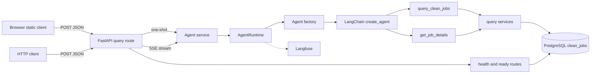
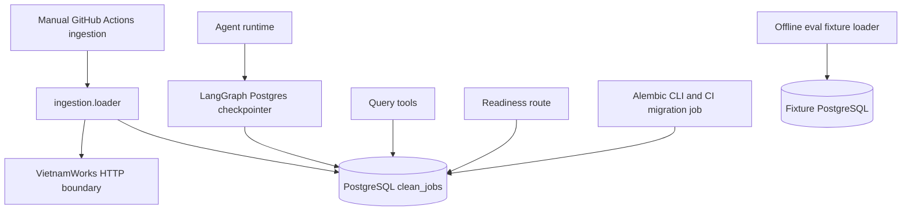
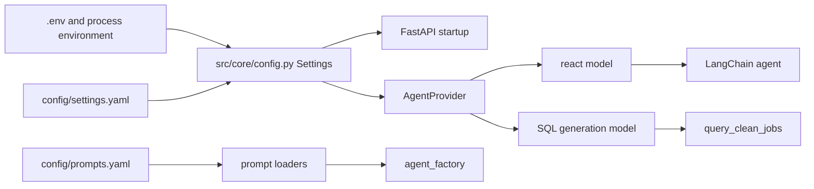
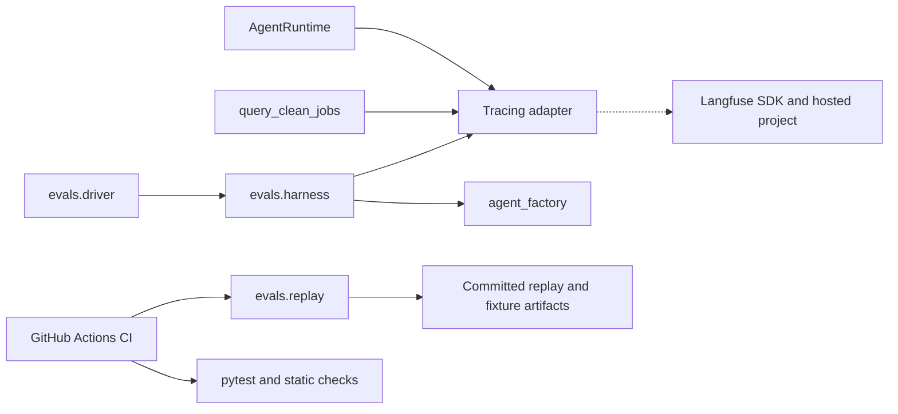
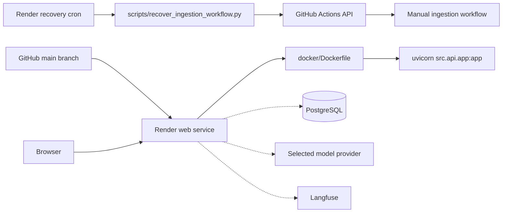

# Current-state architecture maps

> **Last verified:** 2026-09-24 at commit `4d6f00e`.
>
> **Purpose:** This is a source-backed description of the legacy system for [issue #427](https://github.com/Park-Hip/InternHunterAgent/issues/427).
>
> **Decision status:** Verified facts describe checked source and configuration only.
> They do not prove a deployment is live, select a target architecture, or create a compatibility commitment.

## Reading the maps

Solid arrows are direct source or configuration relationships.
Dashed arrows are an external boundary declared by source but not observed in a live environment.
`Verified` means the named files directly establish the relationship.
`Declared` means the repository declares the relationship but this discovery did not observe it running.
`Unknown` means the evidence base cannot establish it.

The source revision includes legacy architecture prose in `docs/architecture.md`.
That prose is supporting context only because it can describe intended behavior that differs from the checked implementation.
The maps below take precedence for current-state discovery because every flow names its source evidence.

## Serving and request flow

| Segment | Status | Source evidence | Current behavior and boundary |
| --- | --- | --- | --- |
| Browser delivery | Verified | `src/api/app.py` (`create_app`); `src/api/static/app.js` | The app mounts `src/api/static/` at `/` after the API routers, so same-origin browser assets can call the API. |
| One-shot transport | Verified | `src/api/routes/query.py` (`query_agent`); `src/api/schemas.py` | `POST /api/v1/agent/chat` validates `QueryRequest`, calls `generate_agent_response`, and serializes `QueryResponse`. |
| Streaming transport | Verified | `src/api/routes/query.py` (`stream_query_agent`); `src/agents/service.py` (`stream_agent_response`) | `POST /api/v1/agent/chat/stream` sends `session`, `token`, `metadata`, `error`, and `done` SSE events. |
| Application orchestration | Verified | `src/agents/service.py` (`generate_agent_response`); `src/agents/service.py` (`stream_agent_response`) | The service creates a session id when absent, applies fallback and error policy, and calls `AgentRuntime`. |
| Runtime construction | Verified | `src/api/app.py` (`lifespan`); `src/agents/runtime/factory.py` (`agent_factory`) | Startup loads settings, checks the serving schema, creates a Postgres checkpointer, and builds the LangChain agent with two tools. |
| Read path | Verified | `src/agents/tools/query_clean_jobs.py`; `src/agents/tools/get_job_details.py`; `src/services/query/` | The tools reach query services and the `clean_jobs` corpus through SQLAlchemy. |
| Readiness | Verified | `src/api/routes/health.py` (`readiness_check`) | `/ready` executes `SELECT 1`, then obtains a `clean_jobs.last_seen_at` date or a configured fallback. |
| Live consumers and deployed behavior | Unknown | Routes and static assets exist, but no production traffic or browser session was inspected. | No current HTTP or SSE shape should be preserved without an approved compatibility decision. |

The request path has two delivery forms but one application and runtime path.
One-shot invokes `AgentRuntime.ainvoke` and returns a completed JSON response.
Streaming emits a session event before the runtime is called and translates service events to SSE frames.

## Data and persistence flow

| Segment | Status | Source evidence | Current behavior and boundary |
| --- | --- | --- | --- |
| Corpus reads | Verified | `src/services/query/executor.py`; `src/core/db.py` | Query services use `DATABASE_URL` through the SQLAlchemy session factory. |
| Conversation checkpointing | Verified | `src/core/checkpointer.py`; `src/api/app.py` (`lifespan`) | The LangGraph checkpointer is constructed from `DATABASE_URL`, opens during app startup, and runs setup. |
| Declared second database URL | Verified | `src/core/config.py` (`Settings`); `src/core/db.py` | `AGENT_DATABASE_URL` has a separate engine and session proxy, but this source map found no serving checkpointer use of it. |
| Ingestion trigger | Verified | `.github/workflows/ingestion.yml` | Ingestion is manual through `workflow_dispatch`; the scheduled trigger is absent. |
| Ingestion writes and remote source | Verified as source relationship | `src/services/ingestion/loader.py`; `src/services/ingestion/sources/vietnamworks.py` | The offline loader has source and database code paths, but no live source access or write was performed. |
| Recovery automation | Declared | `render.yaml`; `scripts/recover_ingestion_workflow.py` | Render declares a daily cron that can inspect and dispatch the ingestion workflow. |
| Schema evolution | Verified | `alembic/`; `alembic.ini`; `.github/workflows/ci.yml` | Alembic is the migration chain, and CI performs upgrade, metadata, and round-trip checks. |
| Corpus contents, retention, and source authority | Unknown | No production database or provider authorization was inspected. | The legacy corpus must not be treated as an approved MVP data contract. |

## Configuration, prompt, and model flow

| Segment | Status | Source evidence | Current behavior and boundary |
| --- | --- | --- | --- |
| Configuration load | Verified | `src/core/config.py` (`load_settings`) | Settings load `.env` plus `settings.yaml`, `prompts.yaml`, `ingestion.yaml`, and `tech_vocabulary.yaml`. |
| Startup validation | Verified | `src/core/config.py` (`_validate_api_config`); `src/core/config.py` (`_validate_observability_config`) | Startup validates the stream heartbeat and Langfuse taxonomy, but many setting shapes are read at their consuming module. |
| System prompt | Verified | `src/agents/runtime/prompts.py` (`load_system_prompt`); `src/agents/runtime/factory.py` | The LangChain agent receives the system prompt from `config/prompts.yaml`. |
| SQL generation prompt | Verified | `src/agents/tools/query_clean_jobs.py` (`generate_sql`); `src/agents/runtime/prompts.py` | The query tool combines the SQL instruction and schema context, then invokes its own configured model. |
| Serving provider branches | Verified | `src/agents/runtime/provider.py` (`AgentProvider`); `config/settings.yaml` | The code supports DeepSeek and Groq branches, and the checked configuration selects DeepSeek for the `react` and `sql_generation` profiles. |
| Model-provider availability and actual cost | Unknown | Credentials and provider calls were not exercised. | A configured model name is not evidence that a provider account, model, or quota is live. |

## Tracing and evaluation flow

| Segment | Status | Source evidence | Current behavior and boundary |
| --- | --- | --- | --- |
| Request tracing | Verified | `src/agents/runtime/react_agent.py`; `src/agents/tracing/langfuse.py` | The runtime wraps one-shot and streamed calls in a request trace and passes a Langfuse callback when tracing initialized. |
| Optional tracing behavior | Verified | `src/agents/tracing/langfuse.py` | Missing credentials, disabled tracing, or initialization failure leave the client and handler absent. |
| SQL prompt lineage | Verified | `src/agents/tools/query_clean_jobs.py`; `src/agents/tracing/langfuse.py` (`sql_generation_observation`) | The tool requests a best-effort Langfuse prompt reference and records metadata when available. |
| Evaluation harness | Verified | `evals/harness.py`; `evals/driver.py`; `evals/replay.py` | Evaluation can construct the legacy agent and uses fixture, replay, deterministic grading, and optional Langfuse paths. |
| CI gates | Verified | `.github/workflows/ci.yml` | CI runs documentation lint, Ruff, mypy, pytest, fixture loading, replay, and migration checks. |
| Hosted traces, datasets, and scores | Unknown | No Langfuse project or remote capture was inspected. | Source instrumentation does not prove that a trace, dataset item, or score reached Langfuse. |

## Deployment and operations flow

| Segment | Status | Source evidence | Current behavior and boundary |
| --- | --- | --- | --- |
| Container command | Verified | `docker/Dockerfile` | The image starts `uvicorn src.api.app:app` on port 8000. |
| Local topology | Verified | `docker-compose.yml` | Compose defines PostgreSQL and the same API image with port 8000 exposed. |
| Render web declaration | Declared | `render.yaml` | Render declares a Docker web service on `main`, one web worker, and `/api/v1/health` as its health check. |
| Render recovery declaration | Declared | `render.yaml` | Render declares a daily Python cron with GitHub Actions write credentials supplied outside the repository. |
| CI and workflow dispatch | Verified | `.github/workflows/ci.yml`; `.github/workflows/ingestion.yml` | Pull requests run CI; ingestion requires manual dispatch. |
| Hosted service state, secrets, cron state, and deployment revision | Unknown | No Render dashboard, GitHub Actions run, or secret was inspected. | The repository declaration does not establish a deployed service's existence or health. |

## Verification record

| Method | Result | Limit |
| --- | --- | --- |
| Static inspection of the files cited above | Complete | It proves source relationships, not runtime reachability. |
| Repository search for entrypoints, tracing, configuration, evaluation, deployment, and ingestion symbols | Complete | Search is not a dynamic call graph. |
| Production HTTP, SSE, database, provider, Langfuse, Render, or GitHub Actions observation | Not performed | External state remains `Unknown`. |

## Scope boundary

This record intentionally makes no target architecture recommendation.
See [current-state-debt-register.md](current-state-debt-register.md) for material risks and [characterization-evidence-matrix.md](characterization-evidence-matrix.md) for candidate future evidence.
