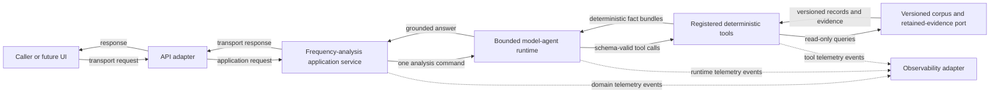

# Target architecture for the bounded single-agent MVP

> **Status:** Proposed target architecture for [issue #434](https://github.com/Park-Hip/InternHunterAgent/issues/434).
>
> **Authority:** [mvp-spec.md](mvp-spec.md) remains the product and behavioral system of record.
>
> **Scope:** This document defines implementation-neutral containers and dependency rules for the supported one-turn technology-frequency workflow.

## Purpose and non-goals

This target separates the public delivery, application, agent, deterministic-analysis, evidence, and observability responsibilities required by the MVP.
It is a replacement target, not a description of the legacy implementation.
The current-state maps and inventory remain the evidence record for legacy behavior and unknowns.

This document does not select an agent framework, agent-loop pattern, model provider, prompt design, persistence technology, tracing service, public API shape, browser behavior, deployment topology, or corpus-acquisition process.
It does not promise preservation, versioning, or retirement of any legacy JSON, SSE, browser, schema, or operational contract.

## Architectural objectives

The target must preserve the MVP's single read-only model agent while preventing the model from becoming a general data-access or execution primitive.
Every factual result must be reproducible from a fixed corpus version, supported filters, the documented counting rule, and retained evidence.
The agent may interpret a request and choose registered tools, but it cannot validate a factual operation, calculate a result, retrieve arbitrary data, or establish evidence on its own.
The target must allow each deferred technology choice to change behind a stable boundary.

## Container view

The solid arrows are permitted request and factual-data dependencies.
The dashed arrows are optional telemetry emission through a local observability port.
No telemetry result can alter validation, deterministic analysis, evidence selection, or the response.

| Container | Owns | May depend on | Must not own |
| --- | --- | --- | --- |
| Caller or future UI | User interaction and presentation. | Public delivery contract. | Agent construction, corpus access, evidence interpretation rules, or internal tool details. |
| API adapter | Transport parsing, transport-level syntactic validation, authentication if separately approved, and response serialization. | Application-service port and transport configuration. | Agent framework types, prompts, tool registration, corpus queries, evidence retrieval, or tracing SDK types. |
| Frequency-analysis application service | The one-turn use-case boundary, request correlation, invocation of the bounded agent, and translation of application outcomes to delivery outcomes. | Agent-runtime port and application error contracts. | HTTP or SSE mechanics, model construction, deterministic calculation, corpus access, and tracing vendor types. |
| Bounded model-agent runtime | Model invocation, registered-tool exposure, schema-valid tool-call mediation, bounded request interpretation, and evidence-grounded response composition. | Tool registry and runtime configuration port. | Direct corpus or evidence access, data mutation, unregistered execution, factual calculation, and transport mechanics. |
| Registered deterministic tools | Supported-question and argument validation, corpus-version and filter validation, filtering, de-duplication, normalized-label lookup, counting, percentage calculation, retained-evidence retrieval, and deterministic limitations. | Corpus and retained-evidence port. | Model invocation, prompt interpretation, transport responses, data mutation, and live-source access. |
| Versioned corpus and retained-evidence port | Read-only access to the selected fixed corpus version, stable record identities, normalized-label evidence, and source evidence. | A future persistence adapter selected by a separate decision. | User-request interpretation, agent behavior, mutable collection, implicit refresh, and presentation. |
| Observability adapter | Conversion of domain telemetry events into a selected tracing, logging, or metrics implementation. | Local telemetry-event contracts and observability configuration. | Correctness decisions, request control flow, raw model authority, corpus access, and public response construction. |

The composition root is the only location allowed to bind a concrete API adapter, application service, agent runtime, tool registry, corpus adapter, and observability adapter together.
The composition root is an assembly concern rather than a business container.
It must not introduce a bypass around the listed boundaries.

## Required dependency rules

1. The API adapter depends only on an application-service interface and transport concerns.
2. The application service depends only on an agent-runtime interface and application-domain types.
3. The model-agent runtime depends only on its registered tool interfaces and runtime configuration interfaces.
4. Deterministic tools depend only on the versioned corpus and retained-evidence port for factual data.
5. The corpus and evidence port depends on no serving, agent, or tool container.
6. Observability is reached through local telemetry-event interfaces and has no return path into factual or response decisions.
7. Concrete framework, provider, database, and tracing SDK types stop at their adapter or composition boundary.
8. Cross-boundary contracts carry domain values, not HTTP objects, ORM sessions, SQL, prompts, agent-framework objects, tracing SDK objects, or raw provider responses.

The following paths are forbidden:

- Caller or API adapter to model-agent runtime, tools, corpus, or evidence.
- Application service to corpus, evidence, or a concrete model provider.
- Model-agent runtime to corpus, evidence, persistence clients, the web, a shell, or an unregistered tool.
- Deterministic tools to a model, live source, ingestion path, mutable data command, or transport response.
- Observability adapter to request validation, tool results, corpus data, or response shaping.
- Any request-path container to ingestion, corpus refresh, source selection, background work, or provider calls outside the selected model-agent runtime.

## Supported-request lifecycle

A supported request follows this sequence.
The sequence describes responsibility handoffs, not an instruction that the model must unconditionally invoke every conceptual tool.

1. The caller sends one technology-frequency question with supported scope filters.
2. The API adapter parses the transport request and rejects malformed transport input without building an agent or accessing the corpus.
3. The application service creates one application request and invokes the bounded model-agent runtime.
4. The model agent decides whether a registered tool is necessary and may only issue schema-valid calls to its registered tool set.
5. A deterministic tool validates the supported-question shape, corpus version, and filters before it reads factual data.
6. Deterministic tools select and de-duplicate records, look up fixed normalized labels, calculate counts and percentages, retrieve retained evidence, and describe any exclusion or limitation.
7. The tools return deterministic fact bundles to the model agent.
8. The model agent returns a bounded answer that presents only those fact bundles and their retained evidence.
9. The application service maps the outcome to a transport-neutral delivery result, and the API adapter serializes it.

An unsupported question, invalid tool arguments, missing evidence, unavailable corpus version, or zero-match result remains a bounded outcome.
It must not trigger an inferred scope, model-created result, fallback data source, live lookup, or invented recommendation.

## Registered deterministic-tool surface

The exact Python functions, concrete tool names, and serialization are deferred to implementation work.
[registered-deterministic-tool-contract.md](registered-deterministic-tool-contract.md) defines the logical operation schemas, deterministic outcomes, and test-double seam.
The target requires the following logical capabilities, whether they are exposed as separate tools or as one narrowly composed registered tool with equivalent validation boundaries.

| Logical capability | Deterministic responsibility | Required result content |
| --- | --- | --- |
| Request and scope validation | Accept only the supported frequency question, corpus version, and corpus-supplied filters. | Supported or unsupported status, canonical supported scope when valid, and a safe limitation when invalid. |
| Frequency analysis | Read the selected immutable corpus version, de-duplicate by stable record identity, look up reviewed normalized labels, and calculate counts and percentages using the documented rule. | Corpus version, supported filters, matching-record count, de-duplication rule, label results, denominator, and calculation rule. |
| Retained-evidence retrieval | Resolve the evidence associated with every reported label and the records used to support it. | Stable record identifiers, retained source evidence references, evidence availability, and explicit exclusions caused by missing evidence. |

A tool may compose these capabilities only if its input schema prevents unsupported scope expansion and its output preserves each required result element.
A tool must not accept free-form SQL, an arbitrary URL, an arbitrary corpus location, a provider instruction, or a write command.

## Technology and compatibility posture

The target deliberately treats the following as ports rather than selected implementations:

- HTTP, SSE, browser, CLI, or other delivery protocol.
- Agent framework, loop pattern, prompt shape, model provider, fallback policy, and model configuration.
- Tool registration mechanism and schema library.
- Corpus storage, evidence storage, cache, and migration strategy.
- Tracing, logging, metrics, and evaluation services.
- Deployment, runtime hosting, credentials, and operations.

Legacy JSON routes, SSE events, browser behavior, health endpoints, database schema, legacy corpus contents, ingestion, and deployment configuration are compatibility candidates only.
No implementation issue may preserve, version, remove, or replace one of those surfaces without an approved compatibility decision and the evidence it requires.

## Relationship to decision records

The discovery ADRs in [target-architecture-adrs/README.md](target-architecture-adrs/README.md) record the decisions expressed by this target and the decisions that remain intentionally deferred.
The [evidence-grounding contract](evidence-grounding-contract.md) and [deterministic-tool evaluation contract](deterministic-tool-evaluation-contract.md) define the inspectability and verification obligations for its factual boundary.
They are scoped to this MVP architecture work and do not alter the historical ADRs under `docs/decisions/`.
