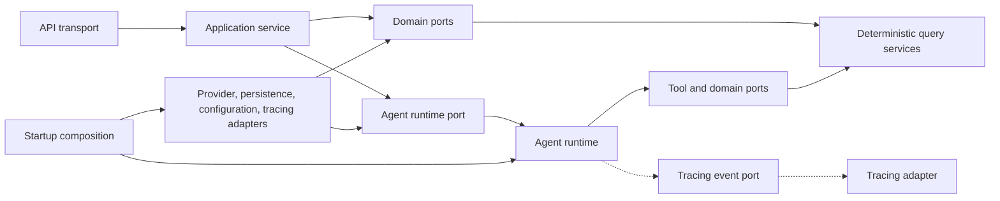

# Target layer and dependency map

> **Last verified:** 2026-09-25
>
> **Eviction:** This map is replaced when an approved architecture decision changes the target layer
> model or when every active refactor slice has reached its documented end state.

## Intended direction

The target direction is API transport to application service to agent/runtime and domain ports.
Infrastructure and tracing implement ports or receive boundary events as replaceable adapters.
Composition assembles implementations at startup and is not API transport behavior.

The diagram is a target dependency rule, not a statement that the current modules already conform.
Arrows show allowed dependency direction.
The dashed tracing path is an event boundary and must not make application orchestration depend on a
concrete tracing type.

## Layer responsibilities

| Layer | Responsibility | May depend on | Must not know |
| --- | --- | --- | --- |
| API transport | Validate and translate HTTP and SSE requests and responses | Application service and transport schemas | LangChain construction, checkpointer setup, provider selection, or tracing implementation |
| Application service | Own request orchestration, session policy, error policy, and response contract | Agent runtime and domain ports | FastAPI, LangChain, Langfuse, database engines, or configuration globals |
| Agent runtime | Execute the conversational workflow and invoke tool ports | Runtime framework adapter, tool ports, and runtime contracts | HTTP delivery, database implementation details, or trace hosting details |
| Tool adapters | Translate agent tool calls to deterministic use cases | Domain ports and tool contracts | HTTP delivery and provider construction policy |
| Deterministic domain services | Validate, query, transform, and format job facts | Domain models and persistence ports | FastAPI, LangChain, model providers, and tracing SDKs |
| Infrastructure adapters | Implement persistence, provider, configuration, and tracing boundaries | External libraries and declared ports | Transport and application policy |
| Composition | Select and connect concrete implementations during startup | Every layer only for assembly | Request handling and business policy |

## Current gaps that motivate the map

| Gap | Source-backed current evidence | Target correction |
| --- | --- | --- |
| API composition | `src/serving/composition.py` now owns settings, schema-guard, checkpointer, runtime, and Langfuse lifecycle assembly; `src/api/app.py` accepts an injected lifespan. | **Resolved by [#443](https://github.com/Park-Hip/InternHunterAgent/pull/443):** keep `app.state.runtime` only as the temporary route compatibility seam until a later application-service boundary slice. |
| Concrete tracing dependency | `src/agents/service.py` imports `StreamLatency` from `src/agents/tracing/langfuse.py`. | Define a tracing event or observation port that keeps application orchestration independent of Langfuse types. |
| Global command configuration | `src/core/config.py` requires serving configuration for ingestion commands. | Define command-specific configuration inputs at the composition boundary. |
| Model construction in two paths | `src/agents/runtime/factory.py` and `src/agents/tools/query_clean_jobs.py` each build a model. | Centralize provider selection behind a runtime or tool-facing model port. |

The current evidence is detailed in the preserved
[debt register](../discovery/current-state-debt-register.md) as D-427-02, D-427-03, D-427-04, and
D-427-10.
Those findings justify backlog ordering only.
They do not select implementation details or compatibility commitments.
