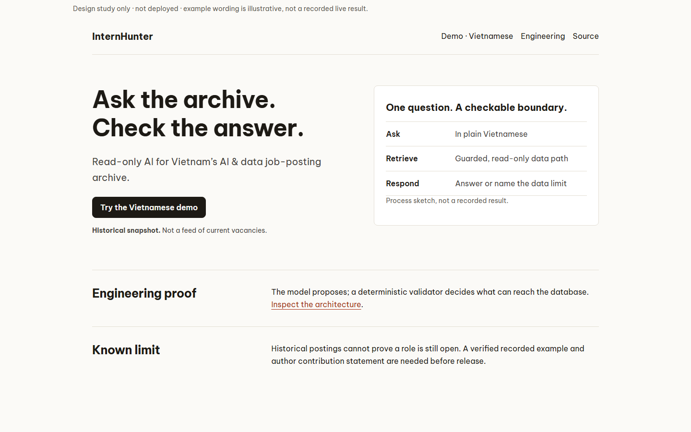
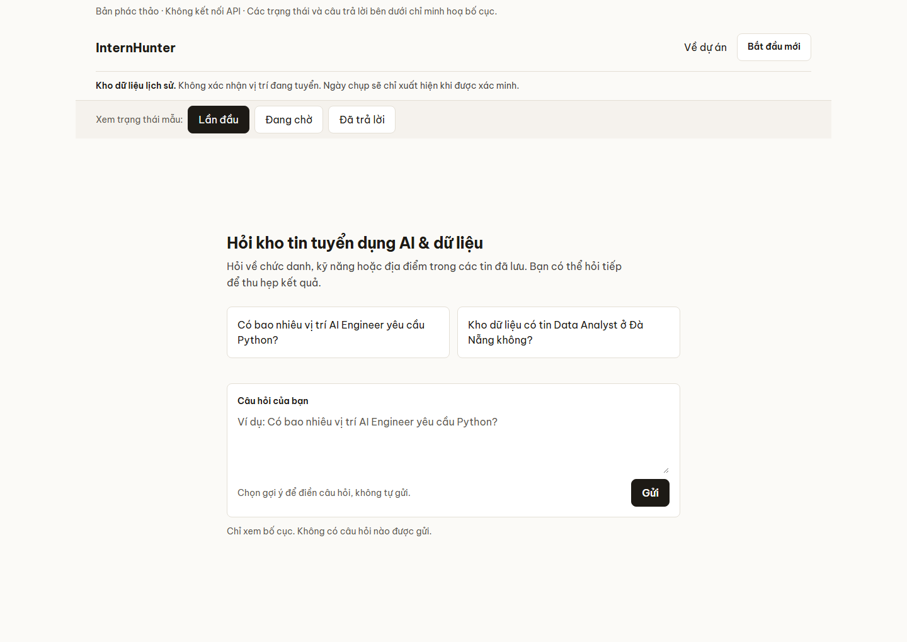
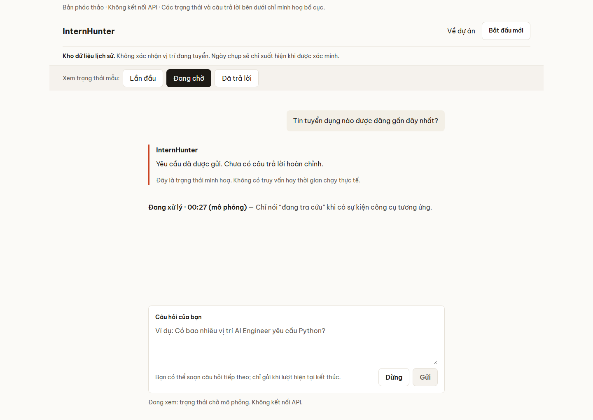
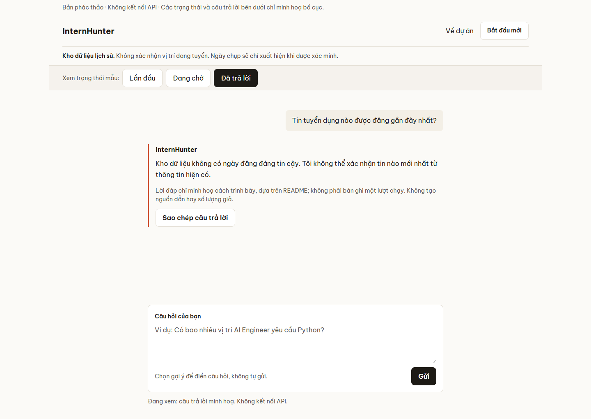

# Employer-facing desktop UI foundation

> **Last verified:** 2026-10-03
>
> **Eviction:** Replace this study baseline when a separately approved implementation establishes a
> newer UI contract; retain the historical approval and trade-offs in issue #552.

**Status:** The maintainer approved the revised desktop visual hierarchy and chat interaction
anatomy for a written spec. This is **not** approval to implement, change routes, publish a recorded
answer, alter the frontend policy, or add result fields. Fine-tuning is expected in later phases.
The linked screenshots below are illustrative local studies, not captures of a deployed app or a
successful agent run. The illustrations were captured from local HTML studies on 2026-10-02 at
1440px desktop width; the source studies are intentionally ignored and are not a published app.

This document owns the approved desktop presentation and interaction intent for two surfaces. The
current product, API, and runtime remain described by [architecture](../architecture.md) and
[agent behavior](../reference/agent-behavior.md). [Issue #552](https://github.com/Park-Hip/InternHunterAgent/issues/552)
records the research, approval, and feedback; the [UI roadmap](https://github.com/Park-Hip/InternHunterAgent/issues/564)
tracks separate work. The roadmap itself is under review, not permission to start its phases.

## The decision in one view

| Audience | Surface and job | Explicit boundary |
|---|---|---|
| Applied AI / LLM engineering reviewer | Short **English** overview: understand the archive, find the demo and inspect engineering decisions | No invented performance, vacancies, recording or author claim |
| Vietnamese visitor | Directly accessible **Vietnamese** conversation: ask, refine, wait, stop and recognize limits | No implied live web, account history or source cards |

Use a quiet research-workbench aesthetic and **familiar chat anatomy**, not another product's
branding. “Familiar” means a compact header, transcript, editable composer, first-visit starters
near the input, a new-conversation action, and visible waiting/Stop states. It does not imply a
sidebar, model picker, uploads, saved searches, or cross-session history. The overview is a compact
project entry, not a second conversation interface.

The art-direction round is desktop-only. Do not turn it into a mobile redesign; ordinary responsive
operation, keyboard access, and narrow-width overflow safety remain requirements. Do not replace
product behavior with polished failure states: [#550](https://github.com/Park-Hip/InternHunterAgent/issues/550)
tracks slow/error turns, and [#551](https://github.com/Park-Hip/InternHunterAgent/issues/551)
tracks missing query evidence and count semantics.

## Surface A: English employer overview

The **revised** overview supersedes the earlier, wordy example-card sketch in #552. At desktop
width, lead with the left-aligned headline “Ask the archive. Check the answer.”, one sentence
explaining the read-only AI/data-posting archive, and **one** prominent “Try the Vietnamese demo”
action. Place “Historical snapshot. Not a feed of current vacancies.” adjacent to that action.
Do not put the limitation only in the footer. The proposed `/` entry and `/demo/` destination are
**route candidates**, subject to the link/static-serving audit and separate approval in
[#560](https://github.com/Park-Hip/InternHunterAgent/issues/560); these paths are not implemented
by this spec.

Opposite the hero, a short Ask → guarded read-only retrieval → answer-or-data-limit flow is a
**process sketch**, explicitly labelled as such. It is not a transcript, a successful answer, or
posting-level evidence. Below the hero, provide a concise engineering decision and an inspectable
link to [architecture](../architecture.md), plus one honest limitation. Keep long technical
arguments in linked docs. A source link must be easy to locate. If an author case study is added,
state actual ownership and material AI assistance after confirmation; do not invent either in
placeholder copy. Do not add a recorded-example button until [#561](https://github.com/Park-Hip/InternHunterAgent/issues/561)
produces a dated, verified, sanitized, rights-cleared useful interaction. A fixture, if chosen,
must be labelled as a fixture rather than live success.

```text
InternHunter                                      Demo · Vietnamese  Engineering  Source

Ask the archive.           | One question. A checkable boundary.
Check the answer.          | Ask → guarded retrieval → answer or named limit
One supporting sentence.  | Process sketch; not a recorded result.
[Try the Vietnamese demo]
Historical snapshot · not current vacancies

Engineering decision → inspectable architecture       Known limit → truthful scope
```

The illustrated snapshot date is **not** a hardcoded universal fact: show one only when the served
readiness value has measured provenance. An unknown date stays unknown. Readiness alone does not
prove the corpus is populated or the agent will answer successfully.



[Inspect the dark-mode overview study](illustrations/landing-desktop-dark.png). Both images are
mockups, not product screenshots or evidence of a completed user interaction.

## Surface B: Vietnamese demo

The demo is reachable directly, without opening the overview first. A compact product header
includes the project return path and “Bắt đầu mới”; a narrow archive line says historical data
cannot establish current vacancies. Do not show an unmeasured date. Keep the transcript and
composer on a shared reading axis with the next input where the current turn ends. Do not add an
empty evidence sidebar or account-history rail. Any optional retrieval disclosure must use only
actually available, safe event fields; a tracing URL is not a posting citation.

| Moment | Visible behavior | Do not imply |
|---|---|---|
| First visit | Two specific, answerable Vietnamese starters beside the editable composer; selecting one fills, focuses and **does not send**. The introductory text is not a fabricated assistant turn. | Recent/live postings, verified counts, or automatic prompt submission. |
| Submitted / waiting | Show text state and elapsed time with Stop. “Đang tra cứu dữ liệu” requires a real tool-running signal; an SSE heartbeat is not progress. Draft may remain editable, but sending another turn is blocked. | ETA, percent complete, queued follow-up, or a successful query before it exists. |
| Receiving / completed | Stream visually, then announce the completed answer **once** to assistive technology. Keep the answer primary and any uncertainty or missing-field limit visible. Respect a reader who scrolled away. | Per-token announcements, fabricated citations or raw reasoning. |
| Stopped / error | Preserve any partial text as **incomplete**, show a safe error or stop state and allow a deliberate retry/new question. | A partial stream as a finished answer or Stop as the normal completion path. |
| Unknown / zero / truncated | Name a missing field as unknown; name a real zero match only when the served result says zero; disclose a shown subset only when the event supports it. | Missing = zero, displayed rows = total matches, or a tool card as source proof. |

The existing UI and the local study are **different**: the study's first-run starters fill an
editable draft while the currently served UI's suggestion buttons submit their questions. The
implementation proposal must explicitly test this behavior change; the mock is not proof the
client already does it. Verify starter answerability against a populated, permitted served corpus
before publishing them; the illustrated questions alone are not that verification. The study's
“most recent” missing-date answer illustrates honest wording, not a recorded result or a
recommended first success example. The first useful example must be supported by a real,
permitted corpus; no adversarial or missing-date prompt should lead the employer's success story.

“Bắt đầu mới” starts a new conversation identity, not deletion of persisted checkpoints. Exact
retention/privacy wording and whether a local reset needs further behavior remain unresolved for
#560; do not present the action as “erase my data” or as browsing previous sessions. The demo
must not queue concurrent turns without a separate behavior decision. Do not submit Enter during
an IME composition session.

The three light-mode images below are **isolated, simulated states**, not successive turns in a
recording. Waiting duration and answer copy are illustrative.

| First visit | Waiting | Finished |
|---|---|---|
|  |  |  |

[Inspect the dark-mode first-visit study](illustrations/chat-first-desktop-dark.png).

## Visual and accessibility baseline

The existing [product tokens](../../src/api/static/tokens.css) and self-hosted Be Vietnam Pro are
comparison scaffolding for this study, **not** a blanket approval to change the project's visual
rules. Proposed desktop shell: 1200px maximum, overview 1120px maximum, transcript reading column
720px maximum (about 65ch), 32px gutters and the existing 4/8/12/16/24/32/48/64px spacing
scale. Header spans the shell; prose remains left-aligned. Use flat hairlines, one 8px radius
family, and no shadows except floating UI. The accent is for the primary action and visible focus,
not every heading or surface. No decorative motion by default.

| Role in study | Light | Dark |
|---|---|---|
| Page | `oklch(98.5% 0.004 85)` | `oklch(16% 0.008 85)` |
| Main ink | `oklch(22% 0.01 85)` | `oklch(94% 0.005 85)` |
| Accent | `oklch(57.2% 0.178 34.5)` | `oklch(70% 0.165 34.5)` |

Overview headline is 49px/1.2, section headings 25px/1.3, support copy about 20px, and demo
answer/composer/control text at least 16px/1.65. Metadata may be 14px/1.5. Dark mode is a token
swap; do not create a separate dark stylesheet. Vietnamese text must render `ệ ữ ỗ ặ ằ ế` in Be
Vietnam Pro without mid-paragraph fallback, including at 200% zoom. All interactive targets meet
the 24x24px floor (primary controls target 44x44px), with visible focus, 4.5:1 text contrast and
`prefers-reduced-motion` support. A growing composer must not obscure keyboard focus. Do not
silently make the composer sticky: focus, scroll anchoring and zoom need implementation testing.

These are **design constraints for later review**, not CSS changes in this PR. Any product-token
change must follow the [frontend-design skill](../../.agents/skills/frontend-design/SKILL.md),
update contrast enforcement and review light/dark captures. Implementing a stream announcement
requires a manual screen-reader check; source inspection alone is insufficient.

## Approval boundaries and open decisions

- **Approved for this spec:** audience, language split, revised scannable overview, desktop
  hierarchy, familiar conversation anatomy, truthful archive boundary and no invented result
  evidence. No specific branded chatbot screenshot was chosen; the approved *pattern* does not
  grant an account/history/sidebar feature.
- **Still requires approval:** #560's route/link migration and production shell behavior. Audit
  existing `/` links and same-origin static serving; preserve direct demo access. Define exact
  new-conversation/persistence wording before implementation.
- **Independent runtime work:** [#550](https://github.com/Park-Hip/InternHunterAgent/issues/550)
  must capture the trailing error and long-turn behavior. Visible progress cannot cure an agent
  error. [#554](https://github.com/Park-Hip/InternHunterAgent/issues/554) closed the served-path
  row-count wiring gap; verify present events rather than assuming the earlier gap still exists.
- **Evidence and permission gates:** [#551](https://github.com/Park-Hip/InternHunterAgent/issues/551)
  decides resolved criteria, match total versus displayed rows, and any tool-event contract.
  [#562](https://github.com/Park-Hip/InternHunterAgent/issues/562) is the separate posting/source
  evidence phase after source-use terms [#137](https://github.com/Park-Hip/InternHunterAgent/issues/137)
  and provenance review. The text-answer shell need not wait for cards.
- **Proof gate:** #561 owns any recorded-example claim. Release-wide evaluation remains in
  [#407](https://github.com/Park-Hip/InternHunterAgent/issues/407); one example or an uptime check
  is not a quality measurement. No accuracy, hiring outcome, current vacancy, broad coverage,
  public tracing access, SQL, chain-of-thought or unpermitted excerpt is promised here.

## Later implementation acceptance, not verification of this document

A reviewer should be able to explain what the overview does, distinguish historical data from
current vacancies, reach the demo directly, and find engineering evidence without the author
narrating the screen. A proposed 30-second understanding and two-minute evidence path are **targets
for a manual study**, not measured employer outcomes. The first phase must also demonstrate
keyboard operation, no IME mis-send, honest wait/stop/error states, a completed answer announced
once, a visible unknown-data boundary, 390px overflow safety and light/dark contrast. When any
product static UI changes, run the repository's screenshot script and read the PNGs back; run
focused UI/API tests and full available gates before review. This document and its study images
do **not** demonstrate those implementation checks.
